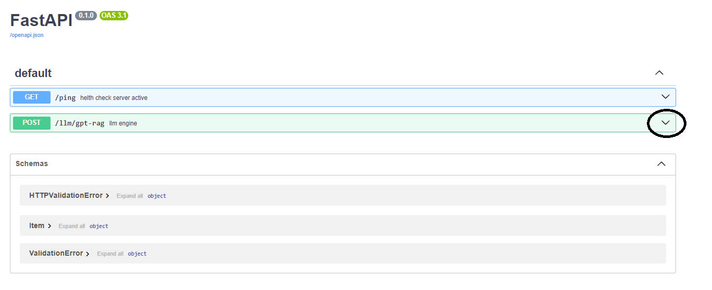
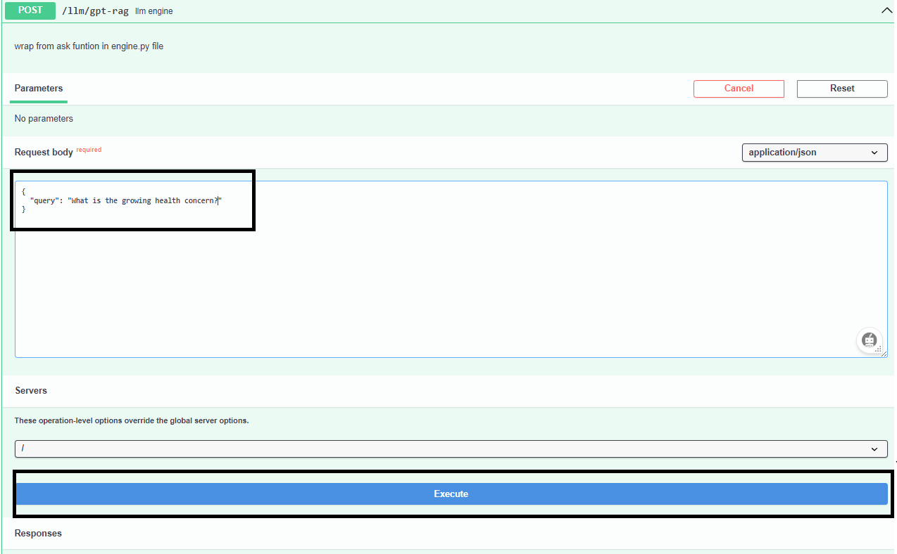
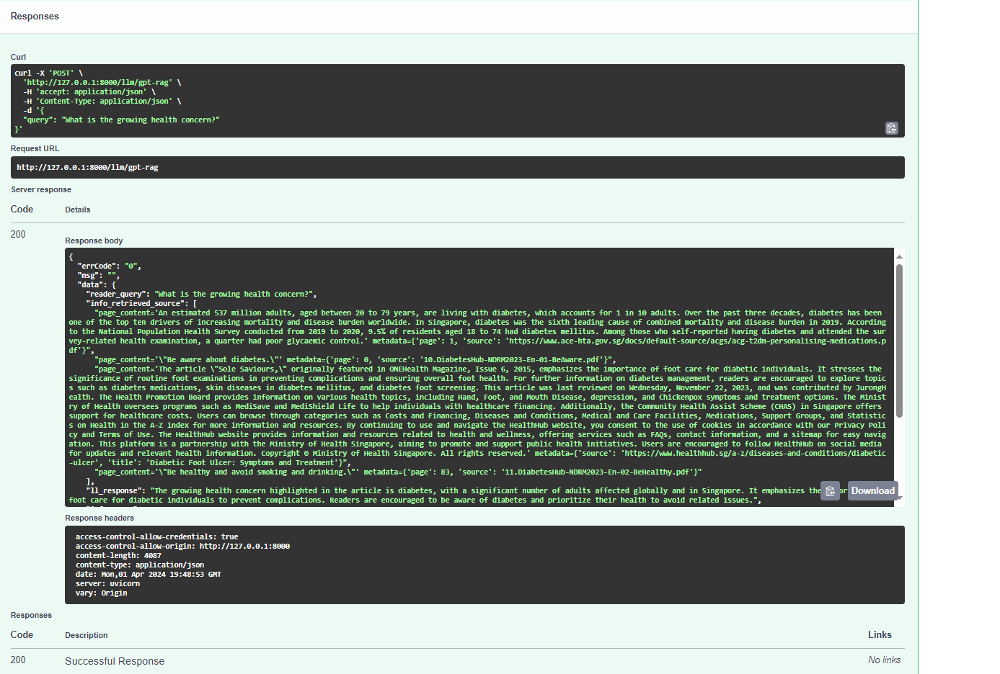
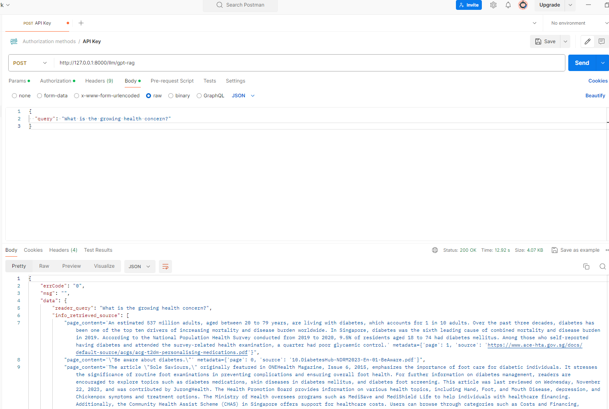

---

# Generative AI for Healthcare 

A local healthcare company published multiple articles containing healthcare facts, information, and tips. It wishes to create a conversational chatbot that can address readers’ concerns in natural language using information from the trusted articles and in the healthcare context.

## Description

The conversational chatbot should answer readers' queries using only the information from the published articles. Where appropriate, it should adopt an empathetic and understanding tone.

Develop the back-end AI framework for a working conversational chatbot that could answer questions from an external data source, i.e. the set of websites provided in the ‘Dataset’ section below, using large language models. Here are some considerations:
1. Ability to answer readers' queries using only the information from the published articles
2. Devise a strategy to reduce LLM hallucinations
3. [Optional Challenge]: Assess the performance of the answers generated from the chatbot, given that there are no ground truth Q&A pairs provided to you.

## Dataset 

A list of 13 public Singapore-based URLs related to diabetes are listed below. These source website articles and/or PDFs containing information on diabetes that you should use to augment the conversational chatbot’s responses.

1. https://www.ace-hta.gov.sg/docs/default-source/default-library/managing-pre-diabetes-(updated-on-27-jul-2021)c2bfc77474154c2abf623156a4b93002.pdf
2. https://www.ace-hta.gov.sg/docs/default-source/acgs/acg-t2dm-personalising-medications.pdf
3. https://www.ace-hta.gov.sg/docs/default-source/acgs/gdm---an-update-on-screening-diagnosis-and-follow-up-(may-2018).pdf
4. https://ch-api.healthhub.sg/api/public/content/8fcd2bf22c2f472c8efbe5c650e3969e?v=a8fc8264
5. https://www.healthhub.sg/a-z/diseases-and-conditions/diabetes-treatment-capsules--tablets
6. https://www.healthhub.sg/a-z/diseases-and-conditions/diabetic_foot_ttsh
7. https://www.healthhub.sg/a-z/diseases-and-conditions/diabetic-ulcer
8. https://www.healthhub.sg/a-z/diseases-and-conditions/diabetes-treatment-insulin
9. https://www.healthxchange.sg/diabetes/living-well-diabetes/diabetes-recommended-vaccinations-children-adults
10. https://ch-api.healthhub.sg/api/public/content/57349b96ccfe47319fb49d902a064022?v=6a601253&_gl=1*ok09oc
11. https://ch-api.healthhub.sg/api/public/content/70e56617c5b140139bb5cb37db3cdef0?v=a7dd48f7&_gl=1*11zfakA
12. https://ch-api.healthhub.sg/api/public/content/0aa3838b8eeb40e6b34a2340a65fdd03?v=eca50be0&_gl=1*1tq2sup
13. https://ch-api.healthhub.sg/api/public/content/57c95e67895840888240d7322f00117c?v=f00ca9b4&_gl=1*1tq2sup


### Directory Structure

- `.git`: Contains Git version control system files.
- `data`: Stores data files used by the application.
- `images`: Holds image files relevant to the project.
- `result`: Saves output results.

### Configuration Files

- `.env`: Environment variable for secret key from OpenAI.
- `config.py`: Configuration settings for the project.
- `environment.yml`: YAML file for creating a Conda environment with required dependencies.

### Source Code

- `database.py`: Functions for chunking/splitting data and storing search vectors.
- `engine.py`: Contains LLM algorithms and processing engine.
- `main.py`: FASTAPI integration.
- `sample_qa.py`: Sample code demonstrating question-answering functionality.

### Documentation

- `readme.md`: Contains project setup, installation, and other information.


### Data Preparation 

- **Faster chunking for storage** Process & chunk all the 13 URLS to TXT or CSV files 

- **Data Sources:** 
    - (A) PDF articles (URL 1-4)
    - (B) Websites (URL 5-9)
    - (C) PDF presentations (URL 10-13).


- **(A):** Manually process due to infographic disarray, then copy to TXT files.

- **(B):** Chunk data recursively, extract words only, process with LLM to form meaningful paragraphs, and save as TXT files.

- **(C):** Split data by slide numbers, extract words and images, process with LLM to form meaningful paragraphs, and save as CSV files.

- **Note:**Python codes for (B) & (C) data processing are in the Jupyter notebook at "data/data_processing_website_ppt-pdf.ipynb"


## Getting Started

### Setting Up of OpenAI Account

- Top up (min. USD 5; should last quite awhile) the OpenAI credit here: https://platform.openai.com
- Click "api-keys" to generate the "SECRET KEY"
- Create `.env` inside clone directory and put "SECRET KEY" inside `.env` 

```.env
OPENAI_API_KEY='<SECRET KEY>'
```


### Setting Up Project Environment 
 Testing has been conducted primarily on Windows environments due to time constraints. If using a different operating system, ensure compatibility and conduct appropriate testing. 
 

### Step 1: Install Conda

If you haven't already, install Conda by following the instructions on the [official Conda documentation](https://docs.anaconda.com/free/anaconda/install/windows/).

### Step 2: Set the working directory and clone the repository:
Copy each codes to the terminal

Setup the directory folder
```bash
cd path/to/your/project/directory
```
Clone the github repository to directory folder
```
git clone https://github.com/hjysam/genai_healthcare.git
```
Set the directory to repository 
```
cd genai_healthcare
```

### Step 3: Set Conda Environment with pip requirements

Execute the following command to create a new Conda environment based on the `environment.yml` file:

```sh
conda env create -f environment.yml
```

This will set up a new environment named `myenv` (or as specified in the `environment.yml` file) with the required dependencies. You may always change `myenv` to another name by editing the environment.yml.

### Step 4: Activate the New Environment

Activate the newly created environment by running: 

```sh
conda activate myenv
```

To deactivate the environment, type the following: 
```sh
conda deactivate myenv
```

### Step 5: Testing the LLM Backend Engine

To test the LLM backend engine in the following steps:

1. Run the `sample_qa.py` script.


2. This script includes 80 sample questions to feed into the engine. Please note that it might take more than 30 minutes to complete.

**Purpose:** The purpose of this test is to evaluate the LLM's ability to answer questions. The first 5 questions are unrelated to any specific context, while the remaining 75 are based on content from 13 different URLs.


```bash
python sample_qa.py
```

Note: Before proceeding, ensure that you have activated the correct environment within the repository folder. Activating the correct environment is essential for accessing the required dependencies and executing commands successfully.
### Result:

After the script is run successfully, you'll find two files under the `result` folder:

- `mulitple_splits.csv`: This file contains records of data chunked or split from the 13 URL, which is stored in chromaDB.
- `sample_output.csv`: This file provides sample outputs for the 80 questions.


### Step 6: FastAPI Testing with Postman

Follow these steps:

1. Start the FastAPI application with the following command:
   
   ```bash
   uvicorn main:app --reload
   ```

2. Open your web browser and navigate to [http://127.0.0.1:8000/docs#/](http://127.0.0.1:8000/docs#/) to access the FASTAPI SwaggerUI.

   

3. Click on the downward arrow next to `/llm/gpt-rag` to expand the endpoint, then click on "Try it out" to enter your query. After that, click "Execute" to submit the query

   

4. Review the response.

   

5. Additionally, you can perform similar steps using Postman to receive the response:

   


## Discussions  

### (I) Answering Queries Using Only Published Articles (13 URLS)

1. **Data Preprocessing:** Organize articles into a structured format optimized for the model's comprehension by performing chunking and splitting. Please refer to the data preparation section for detailed instructions.

2. **Adopting Retrieval Augmented Generation (RAG):** Utilize the OpenAI embedding model (`text-embedding-ada-002`) to create embedding vectors. These vectors are stored in ChromaDB, enabling quick retrieval of the top 4 relevant contexts (over the pandas dataframe) based on the query.

3. **Using `GPT-3.5-turbo` for Prompt Generation:** Employ `GPT-3.5-turbo` to generate prompts based on the below template and context. 

    ```
    template =''' 
    You are a helpful chatbot to answer readers' questions./n 
    Keep the answer as concise as possible and within 50 words/n
    If the question is not related, adopt an empathetic and understanding tone to answer.

    {context}
    Answer the question based on the context: {question}
    Helpful Answer:
    '''
    ```

4. **Query Generation and Reporting:** Generate queries and report them in `sample_output.csv` using conda environment.

5. **Backend Integration with LLM Testing:** Test backend integration with LLM using FastAPI SwaggerUI and Postman for validation purposes. The model is ready for backend deployment. 

### (II) Strategies to Reduce Hallucination 

1. **Data Processing:** Effective data processing is essential for minimizing hallucination. While manual extraction from PDF documents is time-intensive, it ensures sequential tokenization, which is crucial for reducing hallucination.

2. **Section-Based Chunking:** Instead of fixed chunking, opt for section-based chunking to ensure the preservation of information at the sentence or paragraph level. This approach has been demonstrated across various types of URLs to enhance embedding vector accuracy.

3. **Prompt Engineering:** Limiting answers to 50 words through prompt engineering enables the Language Model (LLM) to focus on the most relevant points or phrases. For unrelated questions, employing zero prompting prevents the model from generating irrelevant responses.

4. **Chat History Utilization:** Tracking chat history allows the LLM to employ reinforcement learning techniques, enabling it to respond in a tone consistent with past interactions. This helps mitigate hallucination by maintaining coherence and relevance in responses. 


### (III) Assessing Answer Performance 

1. **Types of Evaluators in Langchain:**
   - **Embedding Distance Evaluator:**
     - Measures semantic similarity between query and retrieved information using cosine distance metrics.
   - **Scoring Evaluator:**
     - Utilizes GPT-4.0 to assign a score from 1 to 10 based on predefined criteria:
       - **Accuracy Criteria:**
         - Score 1: Completely unrelated to the reference.
         - Score 3: Minor relevance but does not align with the reference.
         - Score 5: Moderate relevance but contains inaccuracies.
         - Score 7: Aligns with reference but minor errors or omissions.
         - Score 10: Completely accurate and perfectly aligns with the reference.

2. **Computing Time:**
   - Important for Q&A chatbot backend to maintain a responsive user experience.
   
3. **Cost Estimation:**
   - Necessary to ensure project stays within budget constraints.
   
4. **Number of Tokens:**
   - Directly impacts cost and user experience, especially for prompts.
   - Higher token count may increase expenses and affect usability.


## References

- https://python.langchain.com/docs/integrations/document_loaders/web_base

- https://python.langchain.com/docs/use_cases/web_scraping

- https://python.langchain.com/docs/modules/data_connection/document_loaders/pdf

- https://python.langchain.com/docs/modules/data_connection/

- https://python.langchain.com/docs/guides/evaluation/string/

- https://platform.openai.com/docs/quickstart?context=python)


- https://learn.deeplearning.ai/

- https://www.trychroma.com/


